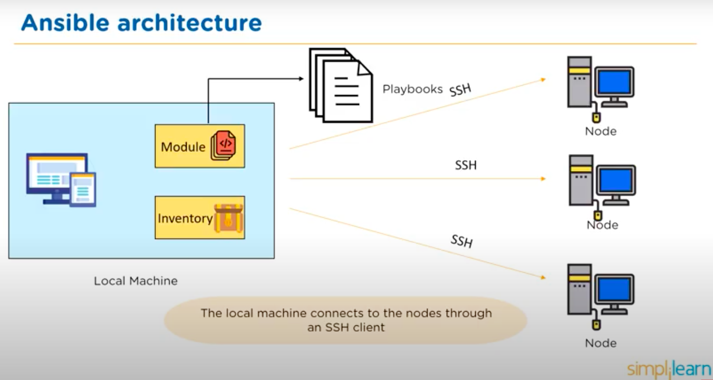

# Infrastructure as Code

## What is IAC?
* Managing and provisioning data through machine readable files.
* Manage IT infrastructure with configuration files

## Benefits
1. Speed- Quickly deploy infrastructure by running scripts.
2. Consistency - Always deploy the same configuration
3. Accountability - Can have version control so pinpoint any sources if failure.
4. Efficiency - Deploy infrastructure in many stages, raise team productivity.
5. Lower Cost - Employ cloud computing alongside IAC therefore significantly reducing costs.

## IAC Best Practices
1. Make code single source of truth - explicitly code infrastructure specifications in configuration files which will then be the single source of truth for infrastructure management.
2. Implement version control
3. Use little to no documentation - let your code speak for itself. If you follow practice 1, you should not need extensive documentation as the code will be the single source of truth.
4. Test and monitor - check for any errors before deploying to production.

# Ansible
## What is Ansible?
* Automation engine
* Automates cloud provisioning, configuration management, app deployment and more.
* Uses YAML syntax
* Requires Python on Linux hosts and PowerShell 3 on Windows hosts.
* Push Configuration Tool - Doesn't require an agent to be installed on the host. The server pushes the configuration to the nodes. (Chef and Puppet are opposite, they use the pull configuration)
## Ansible Architecture?      

* Local Machine - This is where Ansible is installed
  * Module - Collection of configuration code files i.e. playbooks
  * Inventory - Document which groups nodes under specific labels
* Nodes - The systems to be configured. Controlled by the local machine  
* Local Machine connects to nodes using SSH client


## How does Ansible provision one machine?
* Uses Playbooks specify the desired structure of an environment.
* Playbooks:
  * Set of instructions to configure nodes
  * Written in YAML - language used to describe data  
  * List of plays
* Example:
```YAML
#start of script denoted by ---
---
  # We have 2 plays, play 1 and play 2
  -name: play 1  
  # Host is the target for play
  hosts: webserver # webserver is target for play 1
  # Define tasks we want to carry out
  tasks:
    -name: install apache
    yum:
      name: apache
      state: present
    -name: start apache
    service:
      name: apache
      state: start
  -name: play 2
  hosts: databaseserver  # db server is target for play 2
  tasks:
    -name: install MySQL
    yum:
      name: MySQL
      state: present
```  
* Where does the host come from? We use inventory
* Inventory file classifies nodes i.e 
```
[webserver]
web1.machine
web2.machine
web3.machine

[databaseserver]
db1.machine

```
